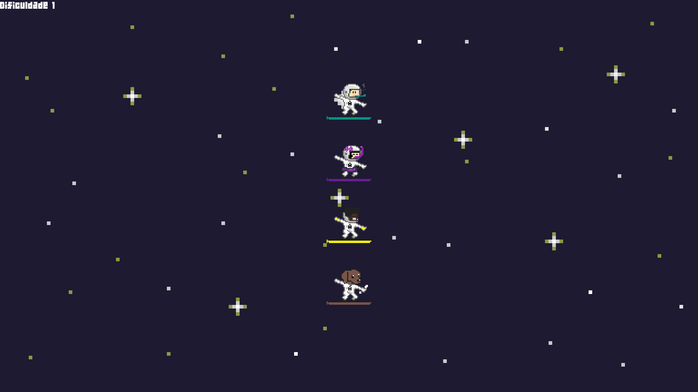
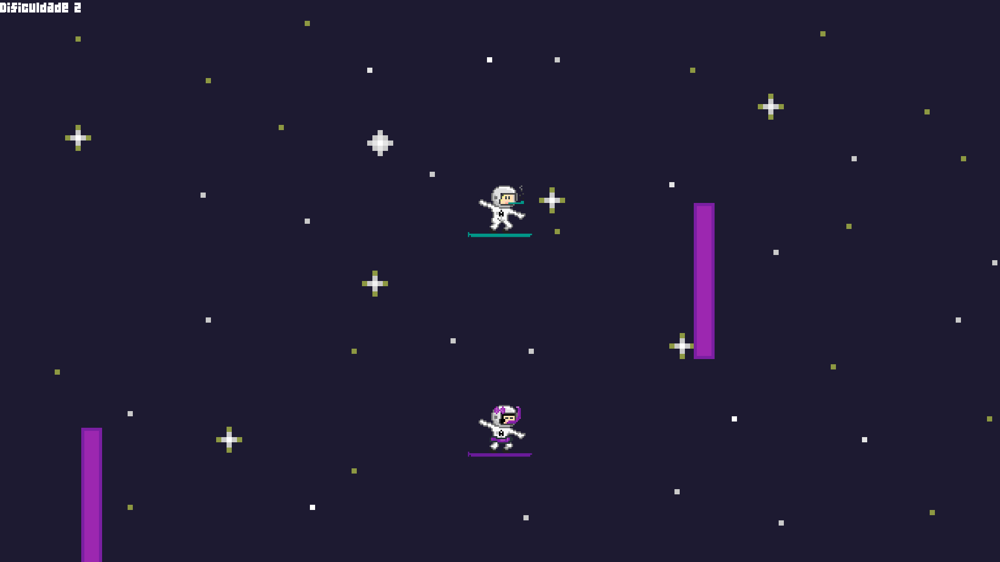

Amia::Mond is a platform game where the goal is to outlast your opponents in an obstacle race. The game can be played by 2 to 4 players.

The gameplay is simple: each player is assigned a key to control their character’s movement (up or down). At the start, all players line up vertically and face different obstacles of varying sizes. If a player goes off-screen, they’re eliminated. The game continues until only one player is left standing.

## Technologies Used

The game was developed in C++ using the SFML library for the graphical interface. It was created as part of a university course focused on learning data structures.

## Figures


<figure style="text-align: center;">
  
  <figcaption>Figure 1. Beginning of a match.</figcaption>
</figure>

<figure style="text-align: center;">
  
  <figcaption>Figure 2. Obstacles during the match.</figcaption>
</figure>

  Check out more on <a href="https://github.com/vicnetto/AmiaMond" target="_blank" rel="noopener">GitHub</a>!


