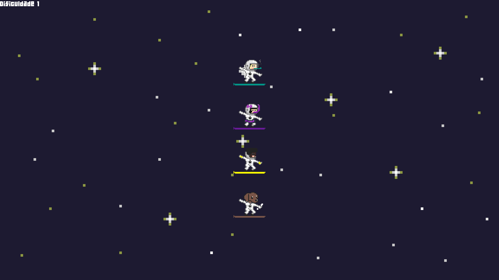

**Amia::Mond** is a platform game where the objective is to defeat opponents in an obstacle race. The gameplay is quite straightforward: each player is assigned a keyboard key to control their character's movement (up or down). The game is played by 2 or more players (up to a maximum of 4).

## Technologies Used

The game was implemented using the **C++** programming language, with the **SFML** library utilized for the creation of the graphical interface.

## Gameplay


<figure style="text-align: center;">
  
  <figcaption>Figure 1. Beginning of the game.</figcaption>
</figure>

<figure style="text-align: center;">
  
  <figcaption>Figure 2. Obstacles in the middle of game.</figcaption>
</figure>

    See more on <a href="https://github.com/vicnetto/AmiaMond" target="_blank" rel="noopener">github</a>!


