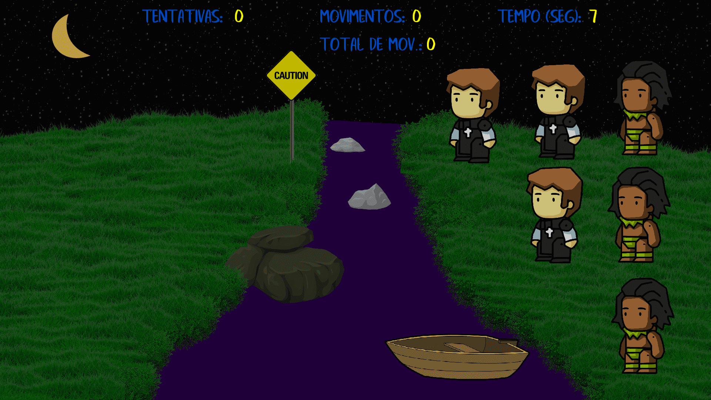
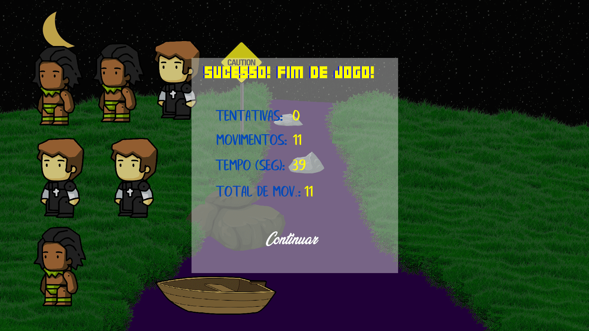

"Missionaries and Cannibals" was a game developed for the Programa de Educação Tutorada (PET) at UTFPR in Curitiba, Brazil. The objective of the game is to transport 3 cannibals and 3 missionaries to the other side of the river. However, a rule prohibits leaving a larger number of cannibals than missionaries on either side of the river.

## Technologies Used

The game was implemented using the **C++** programming language, with the **SFML** library utilized for the creation of the graphical interface.

## Gameplay


<figure style="text-align: center;">
  
  <figcaption>Figure 1. Beginning of the game.</figcaption>
</figure>

<figure style="text-align: center;">
  
  <figcaption>Figure 2. End game.</figcaption>
</figure>

    See more on <a href="https://github.com/vicnetto/Missionarios-Canibais" target="_blank" rel="noopener">github</a>!


