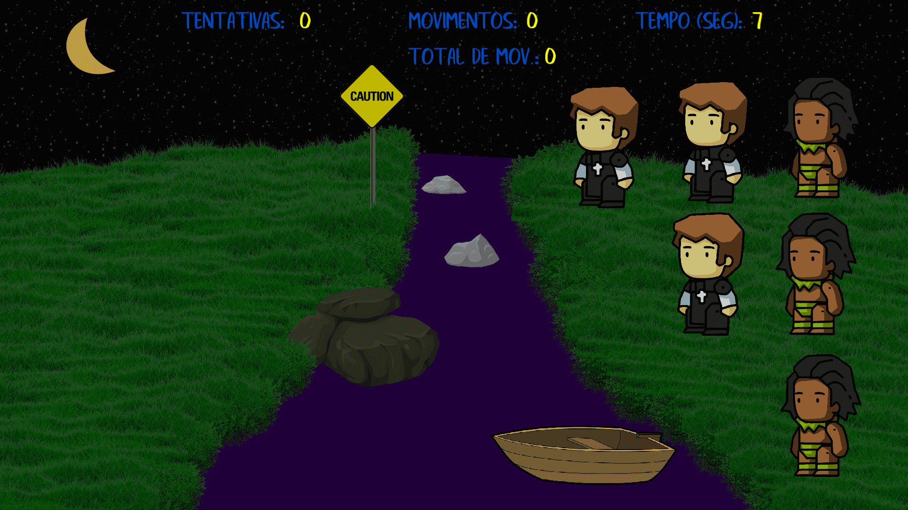
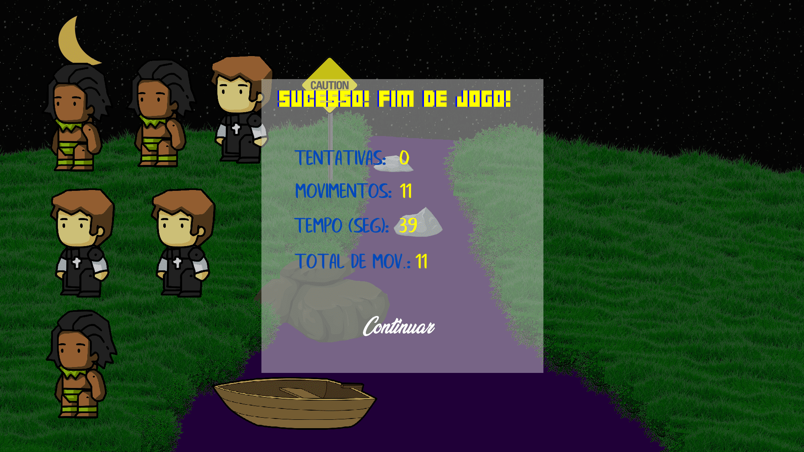

**Missionaries and Cannibals** is a classic river-crossing puzzle game. At the start, three missionaries and three cannibals are on the same side of the river. Using a boat that can carry only two people, both groups must cross to the other side. The only rule is that you can’t leave more cannibals than missionaries on either side of the river at any time.

The game was developed during an internship in the Programa de Educação Tutorada (PET) at UTFPR in Curitiba. The goal was to observe how students approached and solved the puzzle in different contexts.

## Technologies Used

The game was developed in C++, using the SFML library to create the graphical interface.

## Figures


<figure style="text-align: center;">
  
  <figcaption>Figure 1. Beginning of the game.</figcaption>
</figure>

<figure style="text-align: center;">
  
  <figcaption>Figure 2. End of the game.</figcaption>
</figure>

    Check out more on <a href="https://github.com/vicnetto/Missionarios-Canibais" target="_blank" rel="noopener">github</a>!


