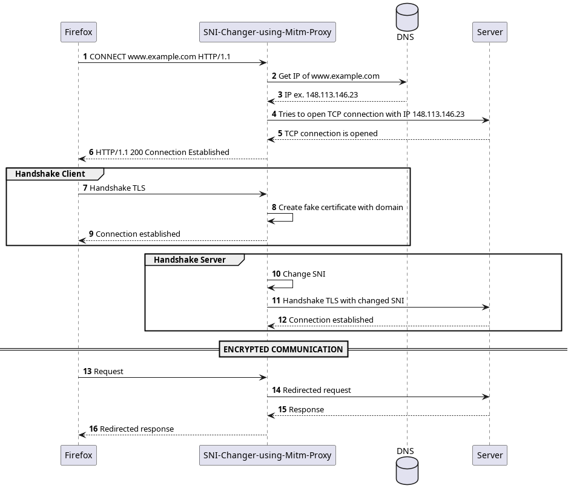
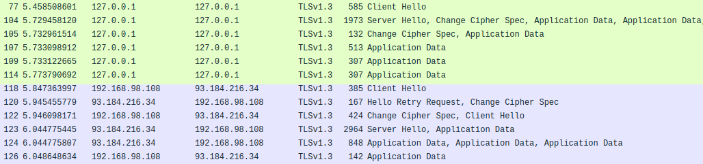
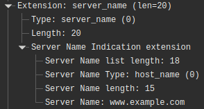
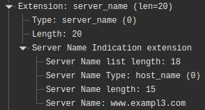

**SNI-Changer-using-Mitm-Proxy** is a tool that modifies the Server Name Indication (SNI) extension inside the TLS `ClientHello` message. It works by using a MITM proxy that intercepts the client's connection and returns a user-created root certificate to the client. The proxy then opens a separate TLS connection to the target server and changes the SNI extension in that `ClientHello`. Once both connections are established, the proxy forwards data between the client and the server, relaying traffic in both directions.



## What is the `ClientHello` message?

When a client (for example, a web browser) starts a secure HTTPS connection, it begins the TLS handshake by sending a `ClientHello` message. That message announces supported protocol versions, cipher suites, and other extensions (including SNI), essentially saying “hello, here’s what I support; let’s negotiate a secure session.”

## What is SNI?

The **Server Name Indication (SNI)** is an extension in the `ClientHello` that tells the server which hostname the client wants to connect to. This is important when a single server hosts multiple domains with different TLS certificates. Without SNI, the server can only present a single certificate (typically the default site). SNI allows the server to choose the appropriate certificate for the requested hostname during the handshake.

## Why change the SNI?

Modifying the SNI can be used to evade certain types of filtering and censorship. The paper [Efficiently Bypassing SNI-based HTTPS Filtering](https://dl.ifip.org/db/conf/im/im2015exp/137348.pdf) explores techniques that change or abuse the SNI to bypass firewalls and other SNI-based filters. Some approaches discussed include:

- **Bypassing based on backward compatibility:** exploiting how servers handle legacy or fallback behaviors, by removing the SNI.  
- **Bypassing based on shared server certificates:** using servers that present the same certificate for multiple hostnames to bypass filters.

## Technologies Used

The tool was implemented in **C** using the **OpenSSL** library to handle TLS connections and generate certificates.

## Example

When running the application, the proxy listens on port `8080`. You can test its functionality using `curl`, which allows sending requests through a specified proxy. For example:

```sh
# The "--insecure" option ignores the fact that the root certificate
# is not recognized by the system. Remove this option if the certificate
# has been added to the system's root certificates.
curl https://www.example.com --proxy localhost:8080 --insecure -v
```

The application responds correctly to requests, establishing one TLS connection with the client (e.g., Firefox) and another with the destination server:

```
(debug) > NEW CONNECTION <
(info) Empty position: 0
(info) Connection fd: 4
(debug) Message sent!
(info) Creating a TLS connection:
(info) Hostname: www.example.com
(info) SNI: www.example.com
(info) Port: 443
(debug) SNI changed to: www.exampl3.com
(debug) Attempting handshake with www.example.com...
(debug) Handshake successful!
(debug) > CONNECTION ESTABLISHED <
(debug) Request sent from 4 to www.example.com!
(debug) Response sent from www.example.com to 4!
(debug) Response sent from www.example.com to 4!
(debug) Request sent from 4 to www.example.com!
(info) Connection closed (user-fd/host-fd[hostname]: 4/5[www.example.com]).
```

This behavior was verified using Wireshark. Figure 2 shows the first TLS connection in green and the second connection to the destination server in blue. Figures 3 and 4 illustrate the server_name in the TLS handshake: the original SNI (www.example.com) and the modified SNI (www.exampl3.com), respectively.


<figure style="text-align: center;">
    
    <figcaption>Figure 2. Network traffic capture of the two handshakes using Wireshark.</figcaption>
</figure>

<div style="display: flex; justify-content: center; gap: 30px;">
  <figure style="display: flex; flex-direction: column; align-items: center; margin: 0;">
    
    <figcaption style="text-align: center;">Figure 3. <i>server_name</i> in the first handshake, in frame 77 of the capture.</figcaption>
  </figure>
  <figure style="display: flex; flex-direction: column; align-items: center; margin: 0;">
    
    <figcaption style="text-align: center;">Figure 4. <i>server_name</i> in the second handshake, in frame 118 of the capture.</figcaption>
  </figure>
</div>

<div align="center" >
    Check out more on <a href="https://github.com/vicnetto/SNI-Changer-using-Mitm-Proxy" target="_blank" rel="noopener">GitHub</a>!
</div>

