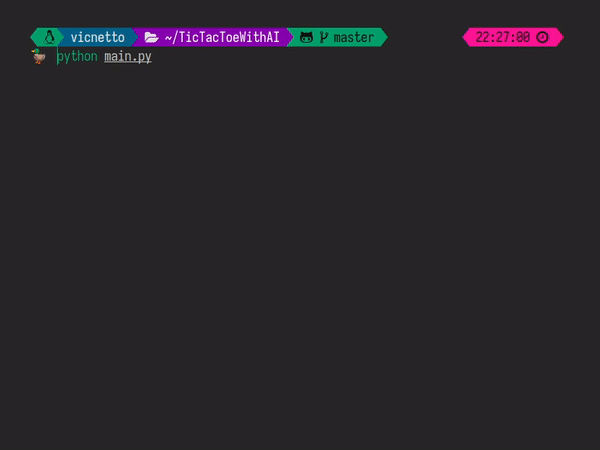

TicTacToe is a classic game, very known by almost every novice programmer (and the rest of the word, of course). Different from the others, this game uses an algorithm called: "Minimax". In the hardest mode, the AI basically runs in between every possible moves, looking only for a win or a draw.

## Technologies Used

The game was developed using only the **Python** programming language, and the terminal was used to display the game board and perform actions within the game.

## Gameplay


<figure style="display: flex; flex-direction: column; align-items: center; margin: 0;">
  
  <figcaption style="text-align: center;">Figure 1. Draw example.</figcaption>
</figure>

See more on <a href="https://github.com/vicnetto/TicTacToeWithAI" target="_blank" rel="noopener">github</a>!


