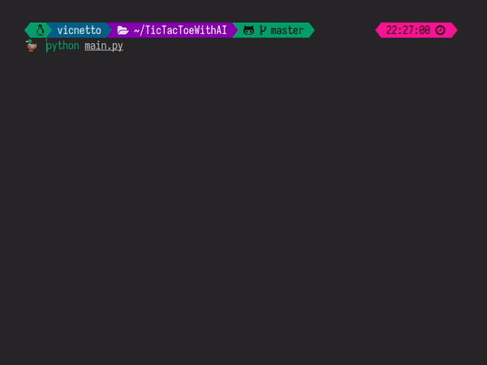

**TicTacToe** is a classic two-player game where opponents take turns marking spaces on a three-by-three grid, one playing as **X** and the other as **O**.

This version uses the **Minimax** algorithm. In the hardest mode, the AI evaluates every possible move to find the best outcome, always aiming to win or, at the very least, force a draw.

## Technologies Used

The game was developed using **Python**, using the terminal to display the board and handle player interactions.

## Figure


<figure style="display: flex; flex-direction: column; align-items: center; margin: 0;">
  
  <figcaption style="text-align: center;">Figure 1. Match between a user and the AI in hard mode.</figcaption>
</figure>

  Check out more on <a href="https://github.com/vicnetto/TicTacToeWithAI" target="_blank" rel="noopener">GitHub</a>!


